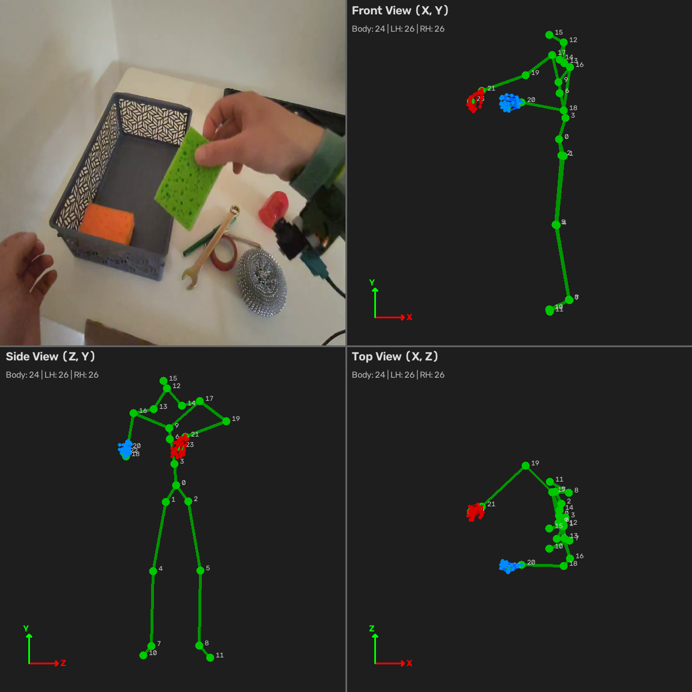

# test-robotics-xr



Визуализация XR body tracking: видео + скелет в трёх проекциях (front/side/top).

В целом можно было попытаться использовать пакеты robotics-xr, но проще и быстрее оказалось разобраться скриптом на python.

Что замечено и исправлено:
1. Текствый файл по сути является JSONL.
2. Данные точек сохраняются как строка и точка заменена на запятую, что портило координаты.

Видео визуализации:


## Установка

```bash
uv sync
```

## Запуск

```bash
uv run main.py
```

По умолчанию используются `record.mp4` и `tracking_data.jsonl` из корня проекта.

### Аргументы CLI

| Флаг | Описание | По умолчанию |
|------|----------|--------------|
| `--video` | Путь к видео | `record.mp4` |
| `--data` | Путь к данным трекинга (JSONL) | `tracking_data.jsonl` |

### Примеры использования


Указать свои пути к видео и данным трекинга:

```bash
uv run main.py --video /path/to/video.mp4 --data /path/to/tracking.jsonl
```
